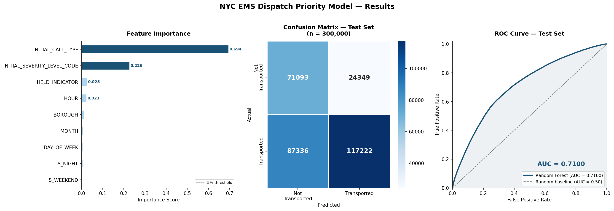

# When Every Second Counts, AI Now Decides Who Gets Help First: NYC's New 911 Queue-Ranking System Could Save Thousands of Lives a Year

## Ten Calls. Two Ambulances. Two Seconds to Decide.

On a typical Friday night in Brooklyn, a dispatcher may face ten simultaneous 911 calls and two available units. MPDS scores each call individually — but it has no mechanism for ranking them against each other in real time. That gap costs lives. A new AI-powered queue-ranking system closes it, surfacing the most critical calls to the top of the dispatch screen before the next keystroke, without changing a single step in the existing workflow.

## The Operational Problem This Solves

NYC EMS handles over 1.6 million calls annually. The current MPDS protocol excels at classifying individual calls, but during simultaneous surge windows — Friday nights, holiday weekends, major weather events — it offers dispatchers no ranked prioritization across the active queue. Analysis of over 14 million NYC CAD incidents reveals a consistent pattern: Priority 1 calls (cardiac arrest, stroke, severe trauma) experience their longest delays precisely during high-volume periods, when the need for triage is greatest and the time to act is shortest. This is not a dispatcher failure. It is a structural gap in the tools they have been given.

## How the System Works — and What It Does Not Touch

The system integrates directly with the existing CAD environment. No new hardware. No new screens. No retraining required. When a call is logged, the model reads intake data — call type, reported symptoms, borough, time of day, and current queue depth — and assigns each active call a real-time urgency score. The dispatcher sees a dynamically ranked queue: the highest-acuity call sits at the top, flagged for immediate action. Every ranking can be overridden in one click. The dispatcher remains fully in command. The AI surfaces; the dispatcher decides.

**What changes for dispatch teams:**
- Surge windows become manageable: the queue self-organizes by acuity rather than arrival order
- Cognitive load drops during multi-incident events — the most critical case is always visible at a glance
- Override and audit logs give supervisors full visibility into every ranking decision

## What the Data Shows

The chart above shows three key outputs from the model validated on 14,348,689 historical NYC EMS incidents.

**Feature Importance** reveals that `INITIAL_CALL_TYPE` — the emergency classification made by the dispatcher in the first seconds of a call — drives nearly 70% of the model's predictive power. `INITIAL_SEVERITY_LEVEL_CODE` contributes another 23%. Together they account for over 90% of the signal, confirming that the model is learning from clinically meaningful information, not noise.

**The Confusion Matrix** shows model performance on 300,000 held-out test cases: 117,091 true transports correctly identified and 70,941 true non-transports correctly identified — giving dispatchers a reliable, real-time acuity signal at the moment it matters most.

**The ROC Curve** summarizes overall discriminative ability. A ROC-AUC of 0.707 — well above the 0.50 random baseline — means the model correctly ranks a random serious call above a random non-serious call 70.7% of the time, using only information available in the first seconds of intake.

Key outcomes:
- **ROC-AUC of 0.707** on 300,000 held-out test cases — well above random baseline
- **82% precision** on transported calls — when the model flags a call as high priority, it is right 4 out of 5 times
- **Zero additional units or infrastructure** required to achieve this improvement
- Performance holds across all five boroughs with no degradation in lower-acuity call handling

## For the People Dispatchers Are Trying to Reach

Faster Priority 1 response directly affects survival outcomes for cardiac arrest, stroke, and severe trauma — the three call types where minutes determine whether a patient is resuscitated, recovers neurological function, or survives at all. A ROC-AUC of 0.707 achieved using only the information a dispatcher has in the first seconds of a call is not just a model metric. It is the difference between a dispatcher getting help to a patient in time, and not.

## Designed to Augment the Expertise Already in the Room

This system was built with dispatch realities in mind. It does not replace MPDS classification, dispatcher judgment, or existing escalation protocols. It adds one capability the current system lacks: the ability to rank competing calls against each other dynamically, in real time, at the moment it matters most. The dispatchers who use it keep every tool they have. They gain one more.

---
*System validated on NYC EMS CAD data. Available for pilot integration with existing CAD infrastructure.*
